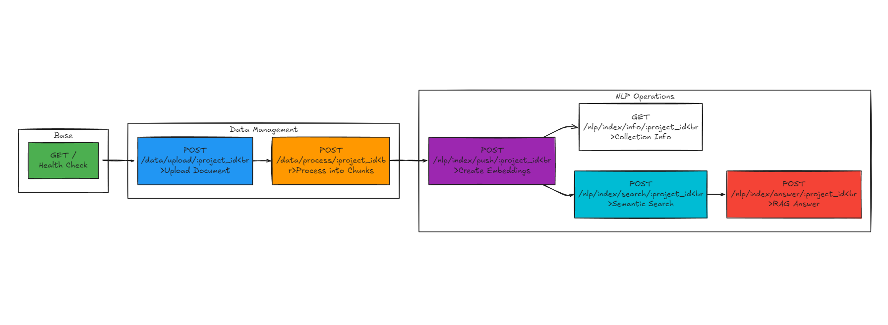

## RAG Chatbot

This is a RAG (Retrieval-Augmented Generation) model implemented to be integrated as a legal chatbot assistant service in a Lawyer Booking system.


## Requirements

- Python 3.8 or later

#### Install Python using MiniConda

1) Download and install MiniConda from [here](https://docs.anaconda.com/free/miniconda/#quick-command-line-install)
2) Create a new environment using the following command:
```bash
$ conda create -n rag python=3.8
```
3) Activate the environment:
```bash
$ conda activate rag
```


## Installation

### Install the required packages

```bash
$ pip install -r requirements.txt
```

### Setup the environment variables

```bash
$ cp .env.example .env
```

Set your environment variables in the `.env` file. Like `OPENAI_API_KEY` value.

## Run Docker Compose Services


```bash
$ cd docker
$ sudo docker compose up  -f <file_name> -d
```


## Run the FastAPI server

**run it inside the src dir.**
```bash
$ uvicorn main:app --reload --host 0.0.0.0 --port 5000
```
## API Documentation

### API Endpoints Overview

The system provides a comprehensive set of RESTful endpoints for data management, processing, and NLP operations:



### Interactive API Documentation (Postman collection & Swagger UI)

Once the server is running, access the interactive API documentation at:
```
http://localhost:5000/docs
```
**You can** test the endpoints **directly from the Swagger UI**.

**you can** also **import** the provided **Postman collection** located at [HERE](./src/assets/api_docs/postman/rag-chatbot.postman_collection.json) **into your Postman application**:
### Comprehensive API Documentation

For detailed documentation, see the **[API Documentation folder](./src/assets/api_docs/)** 

For detailed workflow diagrams, see that **[image](./src/assets/api_docs/images/MongoDB_Qdrant.png)** as well


## References and Official Documentation  
for the **embedding**, **chat generation** and **others**, refer to the following:
- [OpenAI Documentation](https://platform.openai.com/docs/)
- [Cohere Documentation](https://docs.cohere.com/docs)
- [Cohere Models Documentation](https://docs.cohere.com/docs/models)
- [LangChain Documentation](https://python.langchain.com/docs/)
  
- [ollama Documentation](https://docs.ollama.com/)
  [ollama openAI compatibility Documentation](https://docs.ollama.com/api/openai-compatibility)
- [ngrok Documentation](https://ngrok.com/docs)
- [pyngrok Documentation](https://pyngrok.readthedocs.io/en/latest/)
- [FastAPI Documentation](https://fastapi.tiangolo.com/)
- [uvicorn Documentation](https://www.uvicorn.org/)
- [gunicorn Documentation](https://gunicorn.org/)

- [Docker Documentation](https://docs.docker.com/)
- [Docker Compose Documentation](https://docs.docker.com/compose/)

- [mongodb Documentation](https://www.mongodb.com/docs/)
- [qdrant Documentation](https://qdrant.tech/documentation/)

- [mini-rag course, by: Abu Bakr Soliman](https://youtube.com/playlist?list=PLvLvlVqNQGHCUR2p0b8a0QpVjDUg50wQj&si=wkmo-cod8i70qj2w)
  
- [What is RAG (Retrieval-Augmented Generation) Guide by Confluent](https://www.confluent.io/learn/retrieval-augmented-generation-rag/)

<!-- - [jinja Documentation](https://jinja.palletsprojects.com/en/3.1.x/) -->
<!-- 
- [python-dotenv Documentation](https://saurabh-kumar.com/python-dotenv/)
- [pydantic Documentation](https://docs.pydantic.dev/latest/) -->
