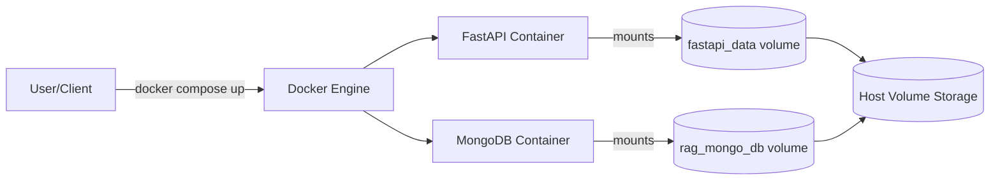
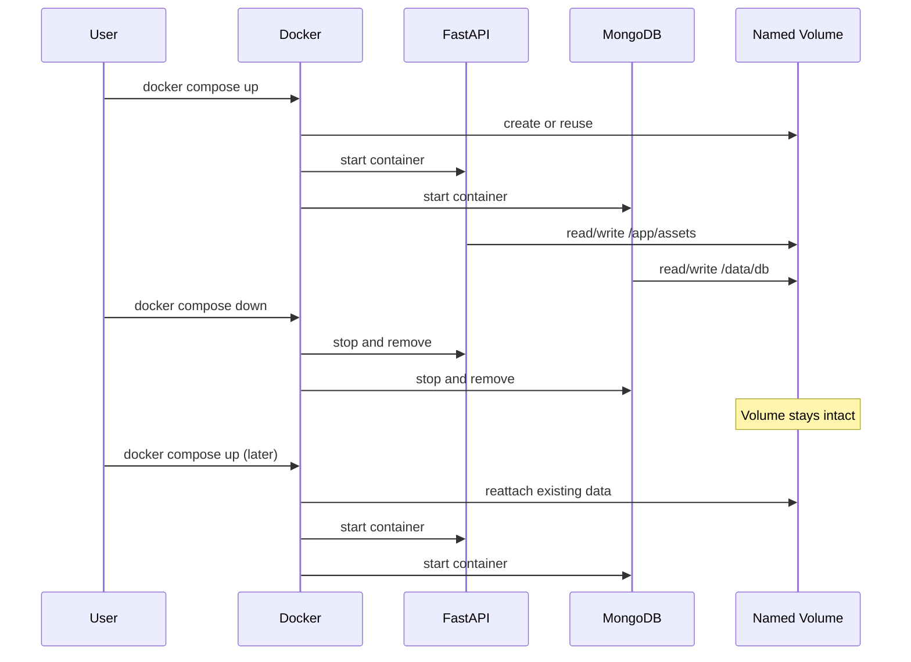
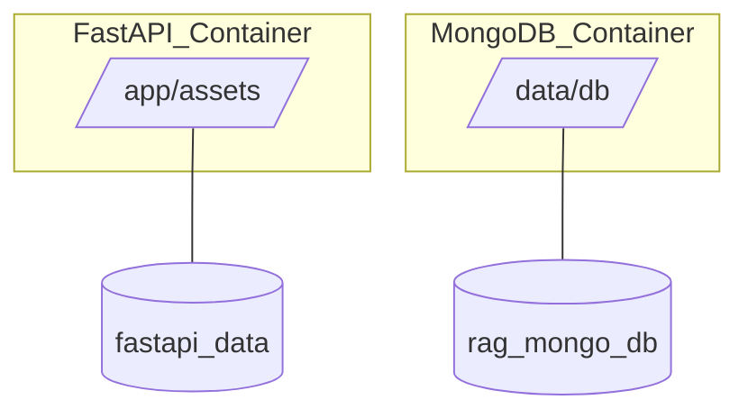
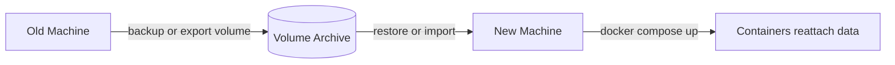

# Docker Data Persistence Flow (Detailed)

This system keeps data across container restarts and even container removal by using named Docker volumes. A named volume lives outside the container filesystem, so it is not destroyed when containers stop or are recreated.

## 1) High-Level Persistence Flow

What this means:

- The containers do not own the data.
- The volumes own the data.
- Containers are replaceable; volumes persist.

## 2) Lifecycle of Containers vs Volumes

Key idea: docker compose down removes containers, not named volumes (unless you add -v).

## 3) Concrete Data Paths (Inside Containers)

Effect:

- Files written by the app to /app/assets persist.
- Database data written by MongoDB to /data/db persists.

## 4) Moving to Another Machine

Volumes live on the local Docker host. If you move the project to another machine, the named volumes do not come with the project folder automatically. You must:

1. Export the volumes from the old machine.
2. Import them into Docker on the new machine.
3. Run docker compose up to reattach the data.

## 5) Common Gotchas

- docker compose down -v deletes volumes (and data).
- docker system prune --volumes can remove unused volumes.
- Moving just the project folder does not move Docker volume data.
