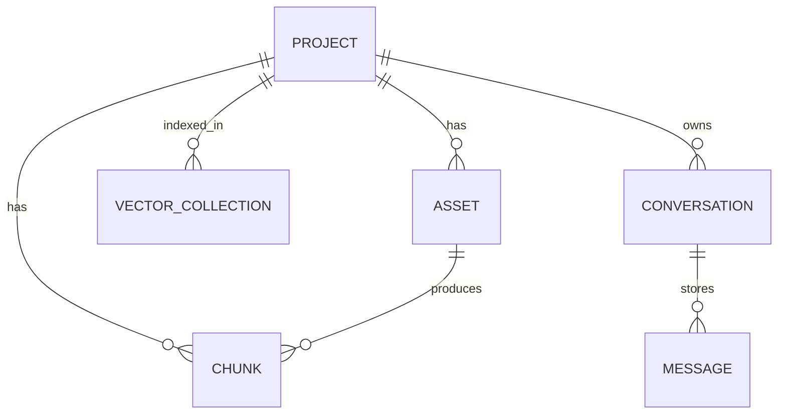
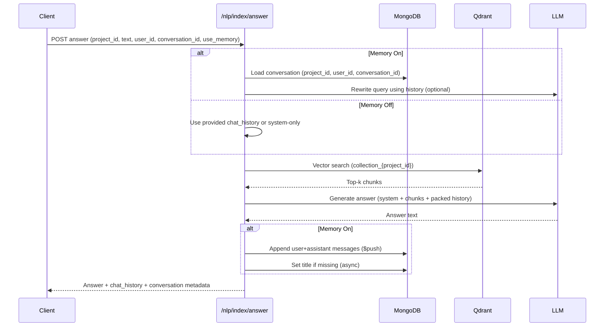

# Memory and Conversations Notes

**Last Updated:** May 5, 2026

## Definitions

- **Project**: A logical workspace keyed by `project_id` in API paths. It groups uploaded files, processed chunks, vector collections, and conversations.
- **User**: A client-level identifier (`user_id`) used to scope conversations. There is no auth layer yet; the ID is passed by the client.
- **Conversation**: A chat thread keyed by `(project_id, user_id, conversation_id)` and stored in MongoDB. It contains message history and an optional title.
- **Memory**: The stored conversation messages used to improve retrieval (query rewrite) and response generation. Memory is enabled only when `use_memory=true` and both `user_id` and `conversation_id` are present.

## Where Data Lives

- **Files**: Stored on disk under `src/assets/files/{project_id}/...` and tracked in MongoDB `assets` collection.
- **Chunks**: Stored in MongoDB `chunks` collection; each chunk references the project and asset.
- **Vectors**: Stored in Qdrant in a collection named `collection_{project_id}`.
- **Conversations**: Stored in MongoDB `conversations` collection, keyed by `project_id`, `user_id`, and `conversation_id`.

## Relationship Summary

- **Files belong to a project**, not to a conversation.
- **Chunks belong to a project** (and an asset). They are indexed into a **project-scoped vector collection**.
- **Conversations belong to a project and a user**. They do not own files or chunks; they only provide context for query rewriting and answer generation.
- **Retrieval always uses the project_id** to pick the right vector collection. Conversation history never changes which collection is searched.

## Entity Relationships (Mermaid)

## What “Memory On” Means

Memory is **on** when:

- `use_memory` is `true`, and
- both `conversation_id` and `user_id` are provided

When memory is on:

1. The system loads the conversation by `(project_id, user_id, conversation_id)`.
2. It packs recent messages into a budgeted history window.
3. It optionally rewrites the query using that history (for better vector retrieval).
4. It searches Qdrant using the rewritten query.
5. It builds the final prompt using the original query and the packed history.
6. It appends the new user + assistant messages **atomically** to the conversation in MongoDB.
7. It may generate a conversation title asynchronously on the first turn.

## What “Memory Off” Means

Memory is **off** when:

- `use_memory` is `false`, or
- either `conversation_id` or `user_id` is missing

When memory is off:

- No conversation is loaded or persisted.
- The system uses only the provided `chat_history` (if any) or just the system prompt.
- Query rewrite can still happen **if** `chat_history` is provided and `enable_query_rewrite` is `true`.

## Answer Flow (Memory On vs Off)

## Conversation Creation

- Conversations can be created explicitly via `POST /nlp/conversations/{project_id}`.
- If memory is enabled and the conversation does not exist, the answer flow can still create it during the first append.
- Titles are generated asynchronously after the first answer, if empty.

## Key Scoping Rules

- `project_id` scopes **files, chunks, and vector search**.
- `user_id` scopes **who owns a conversation** within a project.
- `conversation_id` scopes **which thread** within the user + project scope.
- Conversations do **not** control access to files; they only provide context for retrieval and response.

## Relevant Code Locations

- Answer flow: [src/controllers/nlp_controller.py](src/controllers/nlp_controller.py)
- Memory helpers: [src/controllers/conversation_controller.py](src/controllers/conversation_controller.py)
- Conversation storage: [src/models/conversation_model.py](src/models/conversation_model.py)
- Conversation routes: [src/routes/conversations.py](src/routes/conversations.py)
