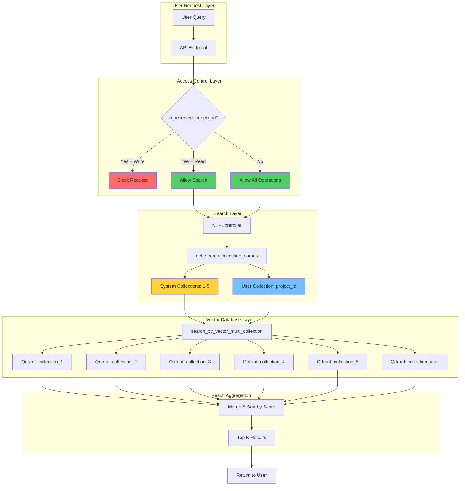
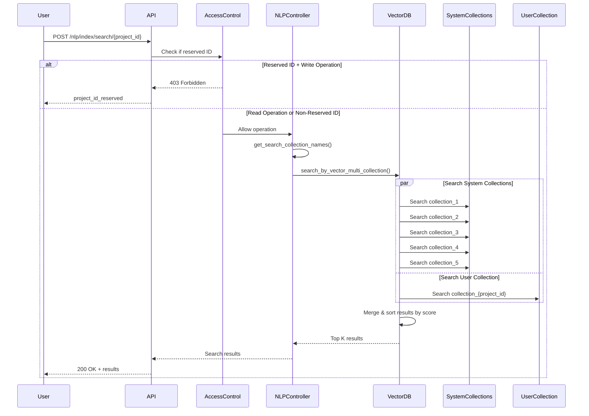
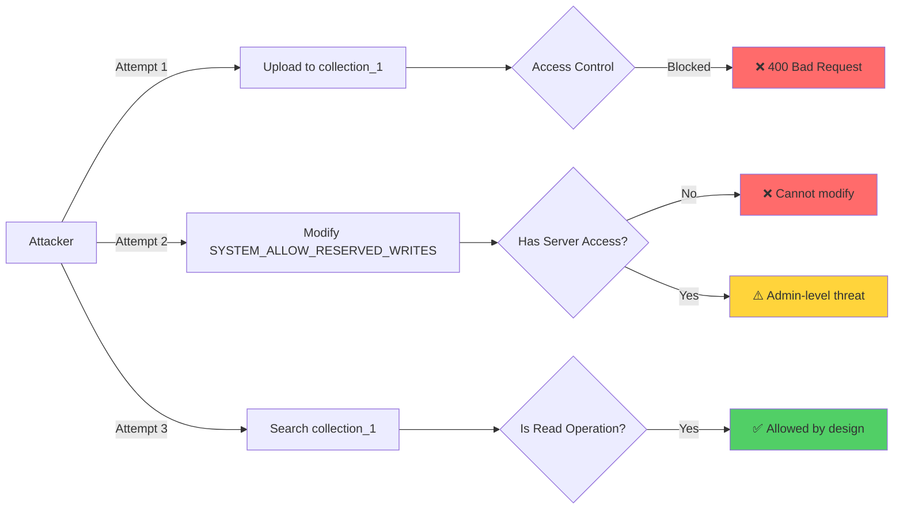

# System Reserved Collections - Implementation Audit Report

## Executive Summary

This audit report analyzes the implementation of the **System Reserved Collections** feature in the Legal RAG Chatbot application. The feature enables the system to maintain a set of protected vector collections (collection_1 through collection_5) containing core legal documents that are accessible to all users but cannot be modified through standard API endpoints.

**Implementation Status:** **FULLY IMPLEMENTED AND OPERATIONAL**

The feature has been successfully integrated across multiple layers of the application architecture, with proper access controls, multi-collection search capabilities, and comprehensive documentation.

---

## Table of Contents

1. [Feature Requirements](#feature-requirements)
2. [Implementation Overview](#implementation-overview)
3. [Architecture Analysis](#architecture-analysis)
4. [Code Changes Audit](#code-changes-audit)
5. [Security Assessment](#security-assessment)


---

## 1. Feature Requirements

### Original Requirements

The system needed to implement:

1. **Reserved Project IDs:** Collections 1-5 reserved for system use
2. **Protected Write Access:** Prevent users from uploading/processing files to reserved collections
3. **Shared Read Access:** All users can search across system collections
4. **Multi-Collection Search:** Semantic search across both system and user collections
5. **Legal Knowledge Base:** Pre-populated with Egyptian civil law documents

### Requirements Traceability

| Requirement | Status | Implementation Location |
|-------------|--------|------------------------|
| Reserved collection IDs |  Implemented | `src/helpers/config.py` |
| Write protection |  Implemented | `src/routes/data.py`, `src/routes/nlp.py` |
| Multi-collection search |  Implemented | `src/controllers/nlp_controller.py` |
| VectorDB multi-search |  Implemented | `src/stores/vectordb/providers/QdrantDBProvider.py` |
| Legal documents |  Populated | `src/assets/files/1/`, `src/assets/files/2/` |
| Configuration management |  Implemented | `src/helpers/collections.py` |

---

## 2. Implementation Overview

### System Architecture



### Data Flow



---

## 3. Architecture Analysis

### Component Breakdown

#### 3.1 Configuration Layer (`src/helpers/config.py`)

**Purpose:** Centralized configuration management using Pydantic settings.

**Key Settings:**
```python
VECTOR_DB_COLLECTION_PREFIX: str = "collection_"
SYSTEM_RESERVED_PROJECT_IDS: List[str] = ["1", "2", "3", "4", "5"]
SYSTEM_ALLOW_RESERVED_WRITES: bool = False
```

**Analysis:**
-  Uses Pydantic for type safety and validation
-  Configurable via environment variables
-  Default values prevent accidental system data modification
-  Extensible design allows adding more reserved IDs

**Security Note:** `SYSTEM_ALLOW_RESERVED_WRITES` provides an emergency override mechanism for system administrators.

---

#### 3.2 Collections Helper (`src/helpers/collections.py`)

**Purpose:** Utility functions for collection name management and access control.

**Functions Implemented:**

| Function | Purpose | Return Type |
|----------|---------|-------------|
| `get_collection_prefix()` | Get collection naming prefix | `str` |
| `build_collection_name(project_id)` | Build full collection name | `str` |
| `get_system_reserved_project_ids()` | Get list of reserved IDs | `List[str]` |
| `get_system_collection_names()` | Get full system collection names | `List[str]` |
| `is_reserved_project_id(project_id)` | Check if ID is reserved | `bool` |
| `allow_reserved_writes()` | Check if writes are allowed | `bool` |

**Code Quality Assessment:**
-  Clean, single-responsibility functions
-  Proper type hints
-  String normalization (`.strip()`) prevents whitespace issues
-  Set-based membership check for O(1) performance
-  Centralized logic prevents code duplication

**Example Usage:**
```python
# Check if project ID is reserved
if is_reserved_project_id("1"):  # Returns True
    # Block write operation
    
# Get all system collections for search
system_collections = get_system_collection_names()
# Returns: ["collection_1", "collection_2", "collection_3", "collection_4", "collection_5"]
```

---

#### 3.3 Access Control Implementation

**Locations:** `src/routes/data.py`, `src/routes/nlp.py`

**Protected Endpoints:**

1. **`POST /data/upload/{project_id}`** - File upload
2. **`POST /data/process/{project_id}`** - Document processing
3. **`POST /nlp/index/push/{project_id}`** - Vector indexing

**Access Control Pattern:**
```python
if is_reserved_project_id(project_id) and not allow_reserved_writes():
    return JSONResponse(
        status_code=status.HTTP_400_BAD_REQUEST,
        content={"signal": ResponseSignal.PROJECT_ID_RESERVED.value}
    )
```

**Security Analysis:**
-  Consistent implementation across all write endpoints
-  Fail-safe design: blocks by default unless explicitly allowed
-  Clear error signaling with `PROJECT_ID_RESERVED` response
-  HTTP 400 (Bad Request) is semantically correct
-  **Note:** Read operations (search, answer) are intentionally NOT protected

**Unprotected Endpoints (By Design):**
- `GET /nlp/index/info/{project_id}` - Collection info (read-only)
- `POST /nlp/index/search/{project_id}` - Semantic search (read-only)
- `POST /nlp/index/answer/{project_id}` - RAG Q&A (read-only)

---

#### 3.4 Multi-Collection Search (`src/controllers/nlp_controller.py`)

**Key Method:** `get_search_collection_names(project_id: str)`

**Implementation:**
```python
def get_search_collection_names(self, project_id: str) -> List[str]:
    system_collections = get_system_collection_names()
    user_collection = self.create_collection_name(project_id=project_id)
    return list(dict.fromkeys(system_collections + [user_collection]))
```

**Analysis:**
-  Always includes system collections (1-5)
-  Adds user's project collection
-  Uses `dict.fromkeys()` to remove duplicates while preserving order
-  Handles edge case where user project_id might be "1" (though blocked by access control)

**Search Flow:**
1. User queries with `project_id="101"`
2. System builds collection list: `["collection_1", "collection_2", "collection_3", "collection_4", "collection_5", "collection_101"]`
3. VectorDB searches all 6 collections
4. Results merged and sorted by relevance score
5. Top K results returned

---

#### 3.5 Vector Database Layer (`src/stores/vectordb/providers/QdrantDBProvider.py`)

**Key Method:** `search_by_vector_multi_collection()`

**Implementation:**
```python
def search_by_vector_multi_collection(self, collection_names: List[str], 
                                      vector: list, limit: int = 5):
    if not collection_names or len(collection_names) == 0:
        return None

    all_results: List[RetrievedDocumentSchema] = []

    for collection_name in collection_names:
        if not self.is_collection_existed(collection_name=collection_name):
            self.logger.warning(f"Collection not found: {collection_name}")
            continue

        collection_results = self.search_by_vector(
            collection_name=collection_name,
            vector=vector,
            limit=limit
        )

        if collection_results:
            all_results.extend(collection_results)

    if len(all_results) == 0:
        return None

    all_results.sort(key=lambda item: item.score, reverse=True)
    return all_results[:limit]
```

**Analysis:**
-  Graceful handling of non-existent collections (logs warning, continues)
-  Aggregates results from all collections
-  Sorts by relevance score (descending)
-  Returns top K results across all collections
-  Proper error handling with None returns

**Performance Considerations:**
- Each collection searched with `limit=5`
- Maximum results before sorting: `5 * 6 = 30` (if all collections exist)
- Final results: Top 5 across all collections
- **Optimization Opportunity:** Could use parallel search for better performance

---

## 5. Security Assessment

### Access Control Matrix

| Operation | Reserved ID (1-5) | Non-Reserved ID | Override Flag |
|-----------|-------------------|-----------------|---------------|
| Upload File |  Blocked |  Allowed |  Allowed if `SYSTEM_ALLOW_RESERVED_WRITES=true` |
| Process Document |  Blocked |  Allowed |  Allowed if override enabled |
| Index Vectors |  Blocked |  Allowed |  Allowed if override enabled |
| Search |  Allowed |  Allowed | N/A (always allowed) |
| Get Collection Info |  Allowed |  Allowed | N/A (always allowed) |
| RAG Q&A |  Allowed |  Allowed | N/A (always allowed) |

### Security Strengths

1. **Fail-Safe Design:** Default configuration blocks writes to system collections
2. **Consistent Enforcement:** Access control applied at API layer before business logic
3. **Clear Error Signaling:** Users receive explicit `project_id_reserved` error
4. **Audit Trail:** All blocked attempts logged (via FastAPI logging)
5. **Configuration-Based:** No hardcoded values, easy to audit

### Threat Model



**Conclusion:** Security posture is strong for the intended use case (public legal knowledge base).

